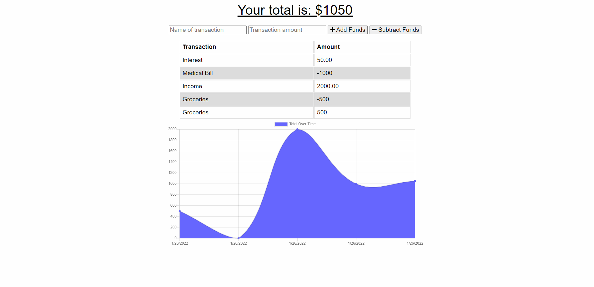

# Budget-Tracker

## Description
This PWA allows users to track their monthly expenses both on and offline. For convience the user can download the application to their desktop. Users will be able to added expensions to their tracker with no internet connection due to indexedDB caching the post and saving it until the connection is restored. 

## Table of Contents (Optional)
* [Installation](#installation)
* [Usage](#usage)
* [Contributing](#contributing)
* [Questions](#questions)

## Installation
Clone the repo, install dependiencies, then run "npm start". The User must have MongoDb installed on their computer. In order to test it's offline functionality, please use Chrome`s Dev Tools to turn the connection to offline.

## Usage
This is what it will look like on your device. 

[Deployed Application](https://bootcamp-budget-tracker-2021.herokuapp.com/)

## Contributing
University of Arizona contributed the Front and Backend code for this project. I added the service-worker.js, Manifest.json, and ibd.js. 

## Questions
Please checkout my [Github](https://github.com/jenmlucas) for other projects. If you have any other questions or concerns, feel free to email me at jenmlucas1@gmail.com.
